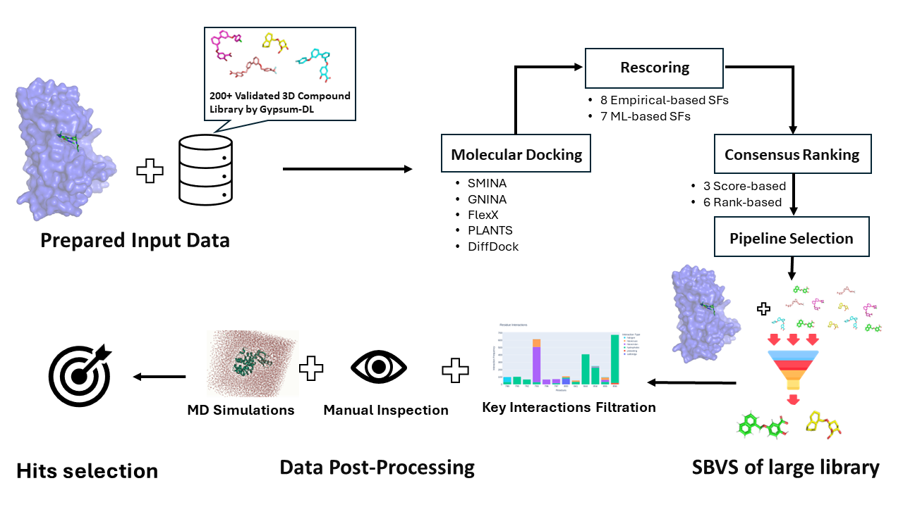

# MolDockLab Workflow

MolDockLab is a **data-driven workflow** designed to identify the best balanced consensus **Structure-Based Virtual Screening (SBVS)** workflow for a tet of interest. The workflow integrates various **docking tools**, **scoring functions**, and **consensus methods** to achieve optimal screening performance.

As a validation case study, the workflow was applied to the **EGFR tet** (Epidermal Growth Factor Receptor) to compare different SBVS pipelines and assess their relative performance. Results can be found in `egfr_data/`.

MolDockLab was used in a real case study to find potential hits for an antibacterial tet called **Energy Coupling Factor (ECF) Transporters**, in a collaboration work with Helmholtz-Institut für Pharmazeutische Forschung Saarland (HIPS). By screening the in-house library of around 6.6K compounds, it resulted in the identification of **two new antibacterial classes** for the tet, which were validated experimentally.


<p align="center">
  
</p>

---

## Repository Structure

- **`egfr_data/`**: Contains the EGFR-specific data used in the MolDockLab workflow, along with the results generated from running the pipeline.
- **`src/`**: The source code directory containing the core implementation of the MolDockLab workflow.
- **`test_data/`**: A small subset of test data (3 compounds for pipeline selection and 10 compounds for SBVS) used to test the workflow on a smaller scale.
- **`test_output/`**: Output generated from running the workflow on the test data.
- **`EGFR_pipeline.ipynb`**: A Jupyter notebook that reproduces the EGFR tet results. Use this to follow along with the pipeline's analysis for EGFR.
- **`moldocklab.py`**: The main script that orchestrates the execution of the MolDockLab workflow.
- **`setup_py310.sh`**: Installation script to set up the Python 3.10 environment and dependencies required to run the workflow.

---

## Installation

Thanks to the [Installation guide of DockM8](https://github.com/DrugBud-Suite/DockM8/blob/main/DockM8_Installation_Guide.pdf), the environment can be installed using the provided `setup_py310.sh` installation script, after adding the needed packages and removing the unused ones.

## Installation

Thanks to the [Installation guide of DockM8](https://github.com/DrugBud-Suite/DockM8/blob/main/DockM8_Installation_Guide.pdf), the environment was adapted to meet the needs of **MolDockLab**. It can be installed using the provided `setup_py310.sh` after opening the terminal in the `MolDockLab` directory, through installation script:

```
bash ./setup_py310.sh
```
For more details or for running on windows, please refer to the the [installation guide of DockM8](https://github.com/DrugBud-Suite/DockM8/blob/main/DockM8_Installation_Guide.pdf)

---
## Usage

### Running the Workflow

To execute the workflow, run the `moldocklab.py` script with your desired parameters. Make sure your input data is ready. You can also use the provided test data in `test_data/` for smaller-scale testing. For reproducibility, the following command can be used with the test data:

```
python moldocklab.py --protein_path test_data/5UG9_noligand_protoss.pdb --ref_ligand_path test_data/ref_ligand.pdb --known_ligands_path test_data/test_three_cpds.sdf --sbvs_ligands_path test_data/test_library_10_cpds.sdf --out_dir test_output --true_value_col true_value --docking_programs gnina smina diffdock plants --pose_quality_checker True 
```
For step-by-step tutorial, the steps in `test_run.ipynb` can be followed.

### Command-Line Options


All uments:
```
  -h, --help                    Show this help message and exit.

Required args:
  --protein_path            Path to the protein file.
  --ref_ligand_path         Path to the reference ligand file.
  --known_ligands_path      Path to the experimentally validated ligands library.
  --sbvs_ligands_path       Path to the le ligand library for SBVS.
  --true_value_col          Column name of the true activity values in the 
                            experimentally validated ligands library.

Optional args:
  --activity_col            Column name for the activity class (default: "activity_class").
  --id_col                  Column name for the ligand ID (default: "ID").
  --protein_name            Protein name for documentation (optional).
  --n_cpus (=1)             Number of CPUs to use for rescoring and ranking.
  --out_dir                 Directory to save results (default: "output").

Docking Options:
  --docking_programs  [DOCKING_PROGRAMS ...]
                            Docking programs to use (allowed_progs: gnina, smina, 
                            diffdock, plants, flexx).
                            Example: --docking_programs gnina smina diffdock
  --n_poses (=10)           Number of poses to generate per docking tool (default: 10).
  --exhaustiveness (=8)     Exhaustiveness for SMINA/GNINA docking tools (default: 8).
  --local_diffdock (False)  Use local DiffDock for predictions (default: False), only       
                            recommended for wrong binding pocket prediction of normal DiffDock.

Rescoring Options:
  --rescoring  [RESCORING ...] 
                            Rescoring functions to use (allowed_progs: cnnaffinity, cnnscore, smina_affinity, scorch, ad4, linf9, rtmscore, vinardo, chemplp, rfscore_v1, rfscore_v2, rfscore_v3, vina_hydrophobic, vina_intra_hydrophobic, hyde).
                            Example: --rescoring cnnscore vinardo
  --corr_threshold (=0.9)   Max. allowed Spearman correlation between two scoring functions.

Ranking Methods:
  --ranking_method  [RANKING_METHOD ...]
                            Ranking methods to use (allowed_methods: best_ECR, ECR_average, average_ECR, rank_by_rank, rank_by_vote, rank_by_number, best_Zscore, average_Zscore, weighted_ECR)
                            Example: --ranking_method best_ECR weighted_ECR
  --runtime_reg (=0.1)      Regularization parameter for runtime cost in pose score 
                            optimization (default: 0.1).

Pipeline Selection:
  --corr_range (=0.1)       Allowed range of Spearman correlation for selecting a pipeline 
                            with the lowest runtime cost.
  --ef_range (=0.5)         Enrichment factor range for selecting the best pipeline.

Interaction Analysis:
  --interacting_chains  [INTERACTING_CHAINS ...]
                            Chains to include in protein-ligand interactions (default: X).
  --key_residues  [KEY_RESIDUES ...]
                            Key residues for interaction filtration can be given manually (e.g., "123A 124B"). 
                            If None, the top four frequent interacting residues from active compounds will be used (default: None).

Diversity Selection:
  --n_clusters (=5)         Number of clusters/compounds to select in diversity selection.

Quality Checking:
  --pose_quality_checker    Enable pose quality checker for used docking tools
                            using PoseBusters (default: False).
  --versatility_analysis    Enable versatility analysis to evaluate MolDockLab workflow performance.
```