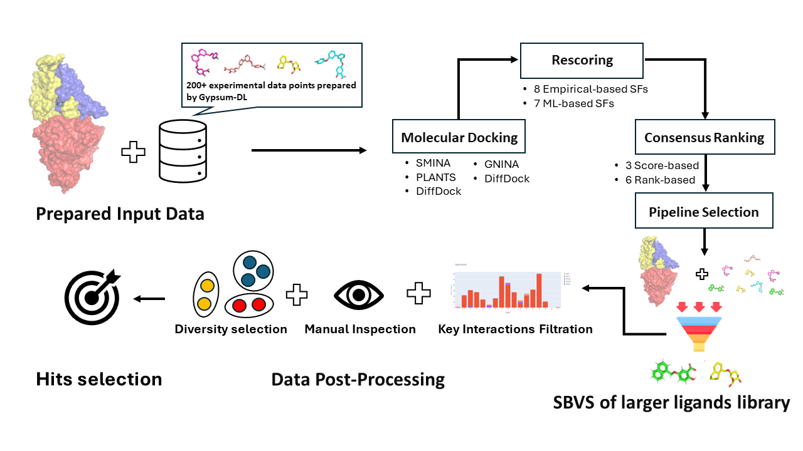

# MolDockLab workflow

Data-driven workflow to find optimal balance of docking tools, scoring functions and consensus methods for a target of interest.

As a validation of the pipeline, we used EGFR target to study the differences between different pipelines.

  

